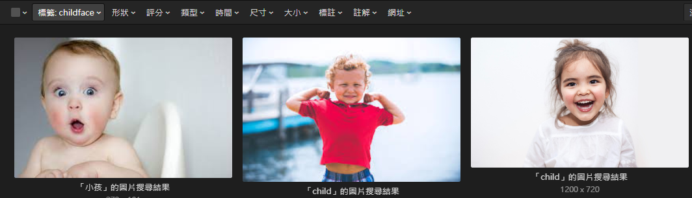

# Eagle-age-autotag summary 
[Eagle](https://tw.eagle.cool/)是優秀的圖片管理軟體，然缺乏自動化的標籤系統。
這邊使用[age-estimation-pytorch](https://github.com/yu4u/age-estimation-pytorch)中的模型做出來的自動標籤系統，使用其提供的pretrained model，掃描Eagle軟體中database的每張圖，並針對其年齡做標籤

Results from [age-estimation-pytorch](https://github.com/yu4u/age-estimation-pytorch):


實際標籤結果


## Requirements
```bash
pip install -r requirements.txt
```
## 使用方法: 執行autotag_main.py
> 因為是自用，就沒有改成從terminal執行的方式了，本人很懶
#### 設定database路徑
```bash
libpath = 'D:\\Eagle Database\\tag_test.library'
```
#### 更改其他預測模型
```bash
resume_path = 'epoch044_0.02343_3.9984.pth'
```
